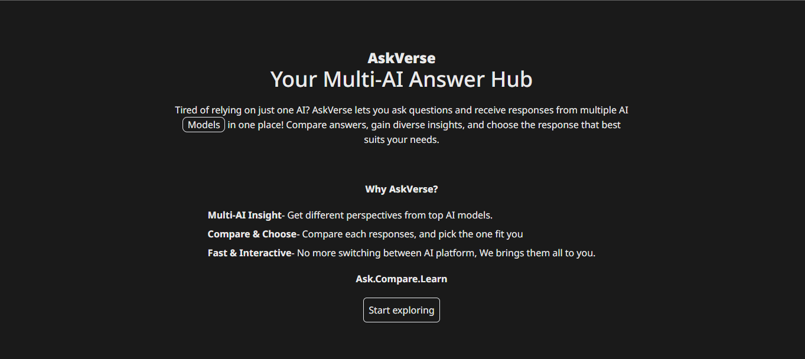
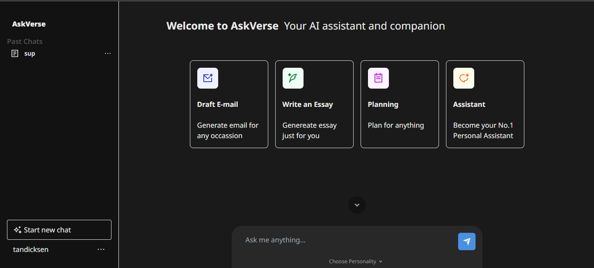
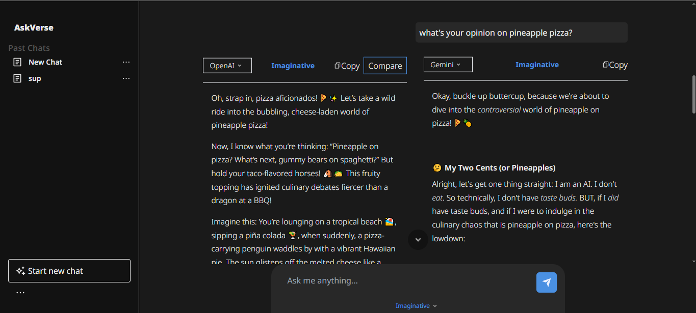
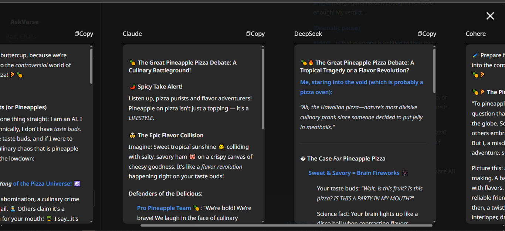
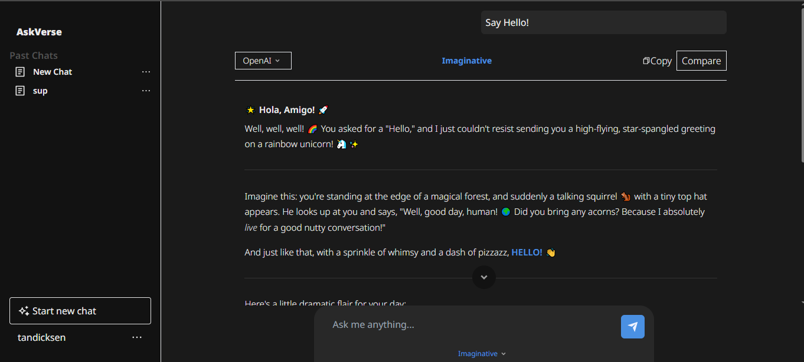

# 🧠 AskVerse — AI Markdown Chat Platform

A full-stack web app that lets users compare responses from multiple AI models (OpenAI, Claude, Gemini, Cohere, DeepSeek) in real-time with rich Markdown rendering.

🔗 **Live Demo**: [askverse.ai](https://askverse.dicksentan.com)  
📁 **Tech Stack**: Next.js, TypeScript, TailwindCSS, MongoDB, Mongoose, NextAuth, OpenAI API

---

## ✨ Features

- 🔁 Compare responses from **OpenAI**, **Claude**, **Cohere**, **DeepSeek**, and **Gemini** side-by-side
- 📝 Custom Markdown renderer with **syntax highlighting**, **Mermaid diagrams**, and **TOC generation**
- 🔐 Auth via **NextAuth** (OAuth2 + Credentials), with **JWT sessions** and account linking
- 🗂️ Persistent chat & message storage via **MongoDB** (Mongoose schemas)
- 🧠 Temperature-aware prompt formatting to highlight model creativity
- 📱 Fully responsive UI optimized for mobile and desktop

---

## 🔐 Security Features
- JWT session hardening via cookies
- XSS prevention via markdown sanitizer
- Login brute-force mitigation
- ENV-based secret protection
See [SECURITY.md](./SECURITY.md) for full audit

---

## 📸 Preview

<p align="center">
  
  <br/>
  
  <br/>
  
  <br/>
  
  <br/>
  
</p>


## ⚙️ Getting Started

```bash
# Install dependencies
npm install

# Add your .env variables (MongoDB URI, NextAuth secret, API keys, GOOGLE Client and Google Secret for OAuth)
cp .env.example .env.local

# Run the app locally
npm run dev
```

---

## 🧠 How It Works

- Auth: Uses **NextAuth** for OAuth2 and Credentials-based login  
- DB: Stores users, chats, messages, and model responses in **MongoDB**  
- Frontend: Built with **Next.js App Router**, **TailwindCSS**, and **Markdown rendering components**  
- LLMs: Uses OpenAI, Gemini, Cohere, DeepSeek, and Claude APIs with adjustable personality(different Temperature)

---

## 🔭 Future Improvements

- Streaming responses (WIP)
- UI theme toggle (dark/light)
- Prompt history reuse and versioning
- Add local vector store + RAG support

---

## 👨‍💻 Author

**Dicksen Tan**  
[Portfolio](https://dicksentan.com) • [GitHub](https://github.com/DicksenT)
